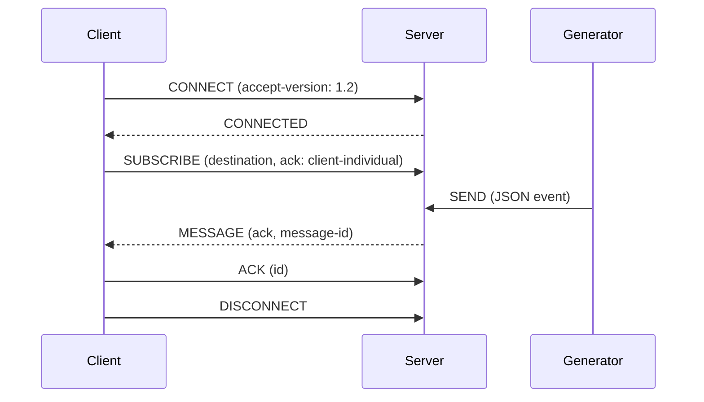

# STOMP 1.2 Playground

This playground deliberately favors small, readable components over throughput. All traffic is STOMP 1.2 over WebSockets; the server, client, and generator are independent Python 3.12 processes.

## Frames

A frame is a command, zero or more `key:value` headers, a blank line, a body, and a NULL byte:

```text
MESSAGE
subscription:sub-0
message-id:uuid
destination:/origin/demo
ack:ack-uuid

{"hello":"world"}\0
```

Header escaping follows STOMP 1.2 (`\\n`, `\\r`, `\\c`, and `\\\\`). The server rejects duplicate headers and frames without the NULL terminator.

## Connection lifecycle



The generator does not subscribe and does not know which clients exist. It reconnects to the server and publishes an event at the configured interval. Delivery is live-only: a subscription only sees events published while it is active, matching plain STOMP 1.2 (there is no durable-subscription or replay concept in the base spec).

## ACK/NACK model

`SUBSCRIBE`'s `ack` header controls how `MESSAGE` frames from that subscription must be acknowledged:

- `auto` (default): no `ack` header on `MESSAGE`, no acknowledgement expected.
- `client`: `MESSAGE` carries an `ack` header (a per-delivery id). Acknowledging one message cumulatively acknowledges every earlier unacknowledged message on that subscription.
- `client-individual`: same `ack` header, but each message must be acknowledged on its own; acknowledging one has no effect on the others.

The client sends `ACK {id: <ack-id>}` after processing a message, or `NACK {id: <ack-id>}` if it can't. The server tracks unacknowledged deliveries per subscription in memory:

- `ACK` removes the message (and, for `client` mode, everything delivered before it) from the pending set.
- `NACK` triggers one redelivery attempt with a fresh `ack` id. If that redelivery is also nacked, the server drops the message and logs it rather than retrying indefinitely.

There is no persistence behind this: an unacknowledged message is only held in the server process's memory for the lifetime of the connection, and a lost connection loses its pending messages. This is a smaller guarantee than durable message queuing, but it matches what STOMP 1.2 itself defines.

## Heartbeats

The client advertises a heartbeat interval. The server disables WebSocket ping frames so the STOMP heartbeat is visible in the code: an idle server connection receives a line-feed heartbeat. A production implementation should track negotiated `heart-beat` values in both directions and close a peer that misses its deadline.

## Run it

```bash
docker compose up --build
```

Open [http://localhost:8000](http://localhost:8000) for the browser dashboard. It is a thin WebSocket client: it connects to the server on port 8080, subscribes to `/origin/demo` with a selectable `ack` mode, shows live `MESSAGE` frames, and lets you ACK or NACK each one. The command-line client remains useful for observing the server-side protocol logs.

The raw frame panel shows the complete frame in each direction, including headers, body, and the NULL terminator. The frame log is kept in browser storage until **Clear** is pressed.

To experiment without Docker, install each service's requirements and run `python server.py`, `python client.py --reconnect`, and `python generator.py` in separate terminals.

## Extension ideas

The command dispatch table is intentionally explicit, making `BEGIN`, `COMMIT`, and `ABORT` good exercises. Other natural extensions are durable subscription metadata, message expiration, and a dead-letter table.
