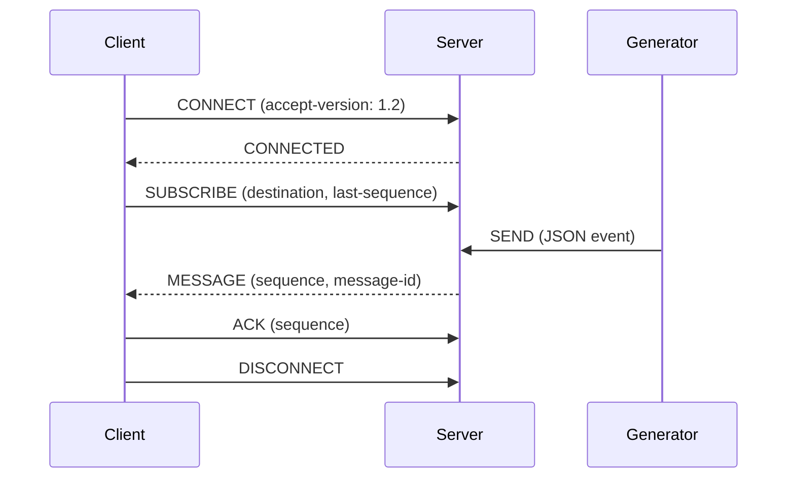

# STOMP 1.2 Playground

This playground deliberately favors small, readable components over throughput. All traffic is STOMP 1.2 over WebSockets; the server, client, and generator are independent Python 3.12 processes.

## Frames

A frame is a command, zero or more `key:value` headers, a blank line, a body, and a NULL byte:

```text
MESSAGE
destination:/origin/demo
message-id:uuid
sequence:42

{"hello":"world"}\0
```

Header escaping follows STOMP 1.2 (`\\n`, `\\r`, `\\c`, and `\\\\`). The server rejects duplicate headers and frames without the NULL terminator.

## Connection lifecycle



The generator does not subscribe and does not know which clients exist. It reconnects to the server and publishes an event at the configured interval.

## Replay extension

`last-sequence` is an application header on `SUBSCRIBE`:

```text
SUBSCRIBE
id:events
destination:/origin/demo
ack:client-individual
last-sequence:55

\0
```

The server sends retained events with sequence greater than 55 before live events. If sequence 55 is older than the configured replay window, the server sends `ERROR`; the client can report that condition and choose a new starting point. Every event has a server-assigned sequence, UUID message-id, UTC timestamp, and destination.

## ACK flow and recovery

The client ACKs each `MESSAGE` and commits the sequence to its local SQLite database only after sending the ACK. If an ACK or connection is lost, the persisted sequence remains behind. On reconnect, the client subscribes with that sequence and receives the missing event(s) again. This is intentionally at-least-once delivery: consumers should make processing idempotent.

`DROP_ACK_PERCENT`, `DROP_EVENT_PERCENT`, `DISCONNECT_AFTER`, and `SERVER_RESTART` are test switches. Set them in the shell before `docker compose up`; for example:

```bash
DROP_ACK_PERCENT=30 DISCONNECT_AFTER=3 docker compose up --build
```

## Heartbeats

The client advertises a heartbeat interval. The server disables WebSocket ping frames so the STOMP heartbeat is visible in the code: an idle server connection receives a line-feed heartbeat. A production implementation should track negotiated `heart-beat` values in both directions and close a peer that misses its deadline.

## Run it

```bash
docker compose up --build
```

Open [http://localhost:8000](http://localhost:8000) for the browser dashboard. It is a thin WebSocket client: it connects to the server on port 8080, subscribes to `/origin/demo`, shows live `MESSAGE` frames, and sends an `ACK` for each event. The command-line client remains useful for observing the server-side protocol logs.

## Guided failure demonstrations

The dashboard's teaching controls exercise the real service behavior:

1. Click **Stop events**, then **Connect** and observe `CONNECT`, `CONNECTED`, and `SUBSCRIBE` frames without new messages. Click **Resume events** to restart publishing.
2. Click **Simulate client crash**. The browser closes without `DISCONNECT`; with auto-reconnect enabled it reconnects using its persisted last ACKed sequence.
3. Click **Drop next MESSAGE**. The server deliberately loses one message. When the browser sees a sequence gap, it reconnects with the last good sequence and receives the missing event from SQLite replay.
4. Click **Reorder next 2 MESSAGEs**. The server sends two messages out of order. The client detects the unexpected sequence and reconnects, turning ordering into replay rather than silently acknowledging the wrong state.
5. Click **Simulate server restart**. The server closes active WebSockets but leaves the SQLite volume intact. The client reconnects and resumes from its last ACK.
6. Enable **Pause ACKs** to see messages arrive without acknowledgements; simulate a client crash, uncheck it, and reconnect to replay those unacknowledged events.

The raw frame panel shows the complete frame in each direction, including headers, body, and the NULL terminator. The frame log is kept in browser storage until **Clear** is pressed.

SQLite files are kept in the `server-data` and `client-data` named volumes. To experiment without Docker, install each service's requirements and run `python server.py`, `python client.py --reconnect`, and `python generator.py` in separate terminals.

## Extension ideas

The command dispatch table is intentionally explicit, making `BEGIN`, `COMMIT`, and `ABORT` good exercises. Other natural extensions are durable subscription metadata, NACK-driven replay, message expiration, and a dead-letter table.
